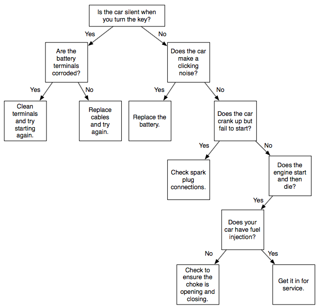

# From the book:  
  
An expert system is a type of artificial intelligence program that uses a knowledge base and a set of rules to perform a task that a human expert might do.  
Many websites are available that will help you self-diagnose a medical issue by answering a series of questions.  
And many hardware and software companies offer online troubleshooting tools to help people solve simple technical issues before calling a human.

Create a program that walks the user through troubleshooting issues with a car.  
Use the following decision tree to build the system: 

**Example Output**  

Is the car silent when you turn the key? y  
Are the battery terminals corroded? n  
The battery cables may be damaged.  
Replace cables and try again.     
  
   
    
For more "**Constraint**" and "**Challenges**".  
Check the book:  
"Exercises for Programmers: 57 Challenges to Develop Your Coding Skills"  
https://pragprog.com/book/bhwb/exercises-for-programmers
